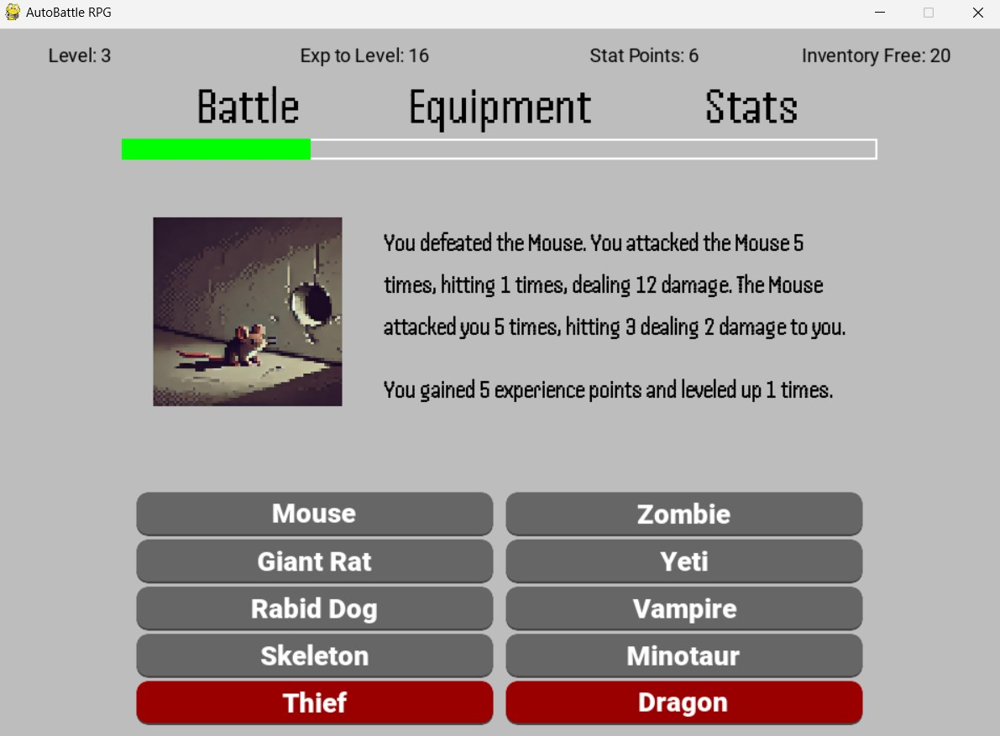

# AutoBattle RPG

A Python game made using pygame showcasing incremental gameplay and RPG elements.

The game automatically attempts to fight the selected enemy every 6 seconds. On defeating an enemy the player is rewarded with experience which will eventually cause the player to gain a level and stat points which can be used to improve 1 of 5 character stats.

Enemies also have a chance to drop randomly generated equipment with a rarity system, which can have various stats themselves.

This game showcases a complete inventory system, 10 enemies, including 2 bosses with their own specific stat types, a player level system, and an incremental game loop.

## Table of Contents

- [Tech Stack](#tech-stack)
- [Preview](#preview)
- [How It Works](#how-it-works)
- [Installation](#installation)
- [Usage](#usage)
- [License](#license)
- [Contact](#contact)

## Tech Stack

 - **Python**: Scripting Language
 - **Pygame**: Python game engine module
 - **InstallForge**: Tool for building executable

## Preview



## How It Works

The main battle loop runs on a 6 second timer
It stores or resets several temporary variables for displaying battle summary
The player and enemy have "turns" But every turn takes place within milliseconds and only the summary of the battle is displayed
The logic checks if player or enemy temp_health is <= 0 and determines the winner based on that.
It then determines rewards based on who won.

## Installation

The simplest way to run the game is with the executable installer [here](https://github.com/nathanialwm/AutoBattle-RPG/releases/tag/v0.10)

Alternatively you can:

Clone the repository

```bash
git clone https://github.com/nathanialwm/AutoBattle-RPG.git
```
Install dependencies
```bash
pip install pygame
```

## Usage

Run the .exe or run AutoBattleRPG.py within your code editor

## License

Unlicensed

## Contact

Nathanial Martin @ [Linkedin](https://www.linkedin.com/in/nathanialm/)
